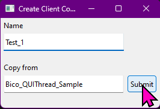

# 🚀 QtQuick Project Template

[](https://pyqtquick-project-template.readthedocs.io/en/latest/?badge=latest)
[](LICENSE)

A modern template for PyQtQuick/PySide6 projects with multi-threaded QML UI integration.

---

## 📚 Official Documentation

👉 [https://pyqtquick-project-template.readthedocs.io/](https://pyqtquick-project-template.readthedocs.io/)

---

## 🎨 QML Preview Tools

- [QmlSandbox - Visual Studio Marketplace](https://marketplace.visualstudio.com/items?itemName=SavenkovIgor.QmlSandboxExtension)
  
- [Online preview of Qt Framework](https://try.qt.io/)
- [qmlonline](https://patrickelectric.work/qmlonline/)
- [QML Online (VSCode Extension)](https://marketplace.visualstudio.com/items?itemName=SavenkovIgor.QmlSandboxExtension)

---

## 🛠️ Features

- PySide6/PyQtQuick project structure
- Multi-threaded QML UI integration
- Sphinx documentation with PlantUML support
- Ready for Read the Docs

---

## 📦 Quick Start

```sh
git clone [https://github.com/yourusername/QtQuick_Project_Template.git](https://github.com/LinhTrucVo/PyQtQuick_Project_Template.git)
cd PyQtQuick_Project_Template
python -m venv .venv
.venv\Scripts\activate  # On Windows
pip install -r venv_requirements.txt
build.bat
```

## Create submodule
```sh
cd src/Client_Code/
python create_client_code.py
```

